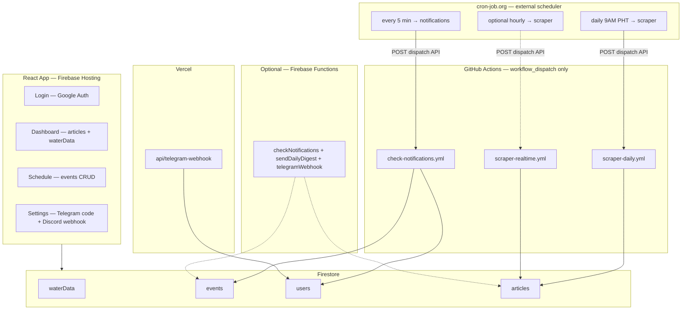

# AquaWatch PH

Real-time water and environmental news for the Philippines, plus personal schedule reminders via **Telegram** and **Discord**.

| Layer | Technology |
|--------|------------|
| Web app | React, Vite, TypeScript, Tailwind CSS |
| Auth & database | Firebase (Google Sign-In, Firestore) |
| Hosting | Firebase Hosting |
| Scheduling | [cron-job.org](https://cron-job.org) → GitHub `workflow_dispatch` (free; disable job = stop runs) |
| Event notifications | GitHub Actions → `scripts/checkNotifications.js` |
| Telegram bot linking | Vercel → `api/telegram-webhook.js` |
| News scraping | GitHub Actions → `scraper/` |
| Marketing page | `railway-landing/` (Railway) |
| Legacy (optional) | Firebase Cloud Functions in `functions/` (requires Blaze for schedulers) |

**Repository:** https://github.com/LostLegacy123/aquawatch

---

## Architecture



**How automation works:** cron-job.org calls GitHub’s API on a timer (same as clicking **Run workflow**). Workflows have **no GitHub `schedule`** for scrapers; notifications can use cron-job.org even if GitHub’s built-in schedule does not run on your repo. **Disable a cron-job.org job** to stop that workflow without changing code.

**Solid lines** — primary paths. **Dotted lines** — optional (hourly scraper, legacy Functions). Do not run **both** Firebase scheduled Functions and cron-job.org notifications, or users may get duplicate messages.

Setup: [docs/cron-job-org-setup.md](docs/cron-job-org-setup.md)

---

## Firestore collections

| Collection | Purpose | Client access |
|------------|---------|----------------|
| `waterData` | Dashboard readings (PAGASA / DOE style) | Public read |
| `events` | User schedules (deadlines, meetings, trips) | Owner read/write |
| `users` | Profile, Telegram link, Discord webhook | Owner read/write |
| `articles` | Scraped news for digest | Public read; writes via Admin SDK only |
| `deadlines` | Legacy (rules may remain; UI uses `events`) | — |

### `events` document shape

```ts
{
  userId: string
  eventKind: "deadline" | "meeting" | "business_trip"
  title: string
  description: string
  scheduledAt: Timestamp
  notifyVia: ("telegram" | "discord")[]
  notificationsSent: string[]   // e.g. "24h", "exact", "miss_10m"
  isCompleted: boolean
  createdAt: Timestamp
}
```

---

## Project structure

```
aquawatch-ph/
├── src/                    # React app
│   ├── pages/              # Dashboard, Schedule, Settings, Login
│   ├── lib/                # Firebase client, Firestore helpers
│   └── hooks/
├── functions/              # Firebase Cloud Functions (legacy / optional)
├── scripts/                # GHA notification checker
├── scraper/                # News scraper + sources/
├── api/                    # Vercel Telegram webhook
├── railway-landing/        # Static landing page
├── docs/                   # cron-job.org setup, automation notes
└── .github/workflows/      # GHA workflows (workflow_dispatch; triggered by cron-job.org)
```

---

## Local development

1. Copy environment variables:
   ```bash
   cp .env.example .env
   ```
2. Fill in `.env` (never commit — `.env` is gitignored).
3. Install and run:
   ```bash
   npm install
   npm run dev
   ```

### Scripts (optional)

```bash
cd scripts && npm install
# Set FIREBASE_SERVICE_ACCOUNT and TELEGRAM_BOT_TOKEN in the shell, then:
node checkNotifications.js
```

---

## GitHub Actions & automation

Workflows use **`workflow_dispatch` only** in YAML (manual button or external trigger). **Automatic runs use [cron-job.org](https://cron-job.org)** posting to GitHub’s workflow dispatch API — see **[docs/cron-job-org-setup.md](docs/cron-job-org-setup.md)**.

| Workflow file | Purpose | Suggested cron-job.org schedule |
|---------------|---------|--------------------------------|
| `check-notifications.yml` | Personal reminders (Telegram/Discord) | Every **5 minutes** |
| `scraper-daily.yml` | Scrape → `articles` + **9AM PHT group digest** (Telegram/Discord) | Daily **9:00 AM** Asia/Manila |
| `scraper-realtime.yml` | Scrape + **share new** articles to group | Every **hour** (optional) |

Turn **off** a cron-job.org job to stop that workflow. Scrapers do not use GitHub’s built-in `schedule` in the repo.

### Repository secrets (Actions)

**Settings → Secrets and variables → Actions**

| Secret | Used by |
|--------|---------|
| `FIREBASE_SERVICE_ACCOUNT` | Notifications, scrapers |
| `TELEGRAM_BOT_TOKEN` | Notifications, Telegram webhook |
| `TELEGRAM_GROUP_CHAT_ID` | Group digest (optional; Functions or future script) |
| `DISCORD_GROUP_WEBHOOK` | Group digest (optional) |

### Manual test

**Actions →** pick a workflow → **Run workflow** (no cron-job.org needed).

---

## Vercel (Telegram webhook)

Deploy the repo (or `api/` folder) on Vercel and set:

- `FIREBASE_SERVICE_ACCOUNT`
- `TELEGRAM_BOT_TOKEN`

Point your bot webhook to:

`https://<your-vercel-domain>/api/telegram-webhook`

Users link from **Settings** with `/start <6-digit-code>`.

---

## Firebase deploy (app + rules)

```bash
npm run build
firebase deploy --only hosting,firestore:rules
```

Deploy Functions only if you still want the legacy path:

```bash
cd functions && npm install && npm run build
firebase deploy --only functions
```

---

## Environment variables

See [`.env.example`](.env.example).

| Variable | Where |
|----------|--------|
| `VITE_FIREBASE_*` | Frontend (Vite) |
| `VITE_TELEGRAM_BOT_USERNAME` | Settings UI copy |
| `FIREBASE_SERVICE_ACCOUNT` | GHA, scraper, Vercel, local scripts |
| `TELEGRAM_BOT_TOKEN` | GHA, Vercel, Functions |
| `TELEGRAM_GROUP_CHAT_ID` | Group news digest (Actions + optional Functions) |
| `DISCORD_GROUP_WEBHOOK` | Group news digest (Actions + optional Functions) |

---

## Links

- Dashboard (placeholder): https://aquawatch-ph.web.app
- Telegram bot: https://t.me/aquawatchph_bot

---

## License

Private project — see repository owner for terms.
